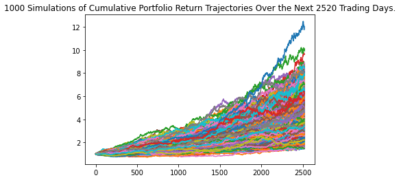
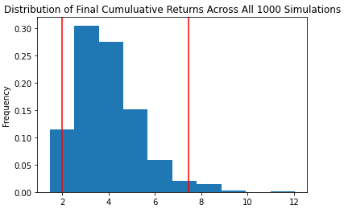

# Financial Planning

## Background

Create an API tool that helps enhance financial health by developing a prototype application to demo as part of a technical solution.
Forecast a reasonably good retirement plan based on mutual funds.

Allow users to visualize their savings composed by investments in shares and cryptocurrencies to assess if they have enough money as an emergency fund.

The tool will be a retirement planning tool that will use an API to fetch historical closing prices for a retirement portfolio composed of mutual funds, then run Monte Carlo simulations to project the portfolio performance at 10 years. You will then use the Monte Carlo data to calculate the expected portfolio returns given a specific initial investment amount.

---

### Files

* [Personal Finance Planner starter code](Monte_Carlo_Index_Funds_Top5.ipynb)

* [MCForecastTools toolkit](MCForecastTools.py)

---

### Resources

This project will utilize an API:

* The **YahooFinancials API** will be used to pull historical mutual funds information.  

---

## Instructions

### Retirement Planning

In this section, you will use the YahooFinancials API to fetch historical closing prices for a retirement portfolio and then Use the MCForecastTools toolkit to create Monte Carlo simulations to project the portfolio performance at `10` years. You will then use the Monte Carlo data to answer questions about the portfolio.

Follow the steps outlined in the starter notebook to complete the following:

#### Monte Carlo Simulation

1. Use the YahooFinancials API to fetch five years historical closing prices for an evenly weighted portfolio using the top 5 performing mutual fund tickers to represent the portfolio. Make sure to convert the API output to a DataFrame and preview the output.

    > *Note*: As before, use the parameter `limit=1000` to ensure you get the most data possible back from the API. In Monte-Carlo Simulation, getting data as far back as possible matters, because if we simulate using only small amounts of data during a recent time when markets are booming, or instead falling precipitously, a Monte-Carlo Analysis will inadvertently extrapolate this temporary market movement too far into the future. Getting data over a longer time period mitigates this effect.

2. Configure and execute a Monte Carlo Simulation of `1000` runs and `10` years for the evenly moweighted portfolio.

3. Plot the simulation results and the probability distribution/confidence intervals.

    
        
    

#### Retirement Analysis

1. Fetch the summary statistics from the Monte Carlo simulation results.

1. Given an initial investment of `$100,000`, calculate the expected portfolio return in dollars at the `95%` lower and upper confidence intervals.

2. Calculate the expected portfolio return at the `95%` lower and upper confidence intervals based on a `50%` increase in the initial investment.

---

### Hints and Considerations

* To allow for quicker work during the Monte Carlo simulation, start out by running `100` simulations for one year of returns, and when you have the code worked out, run the full `1000` simulations for `10` years. 

* Remember to add the `.env` files to the `.gitignore` configuration to avoid exposing your API keys in your GitHub repository.

* A `.gitignore` file contains file names and extensions of files that you don't want pushed to your repository. For more information on how a `gitignore` works, you can read the documentation [here](https://docs.github.com/en/github/using-git/ignoring-files).
