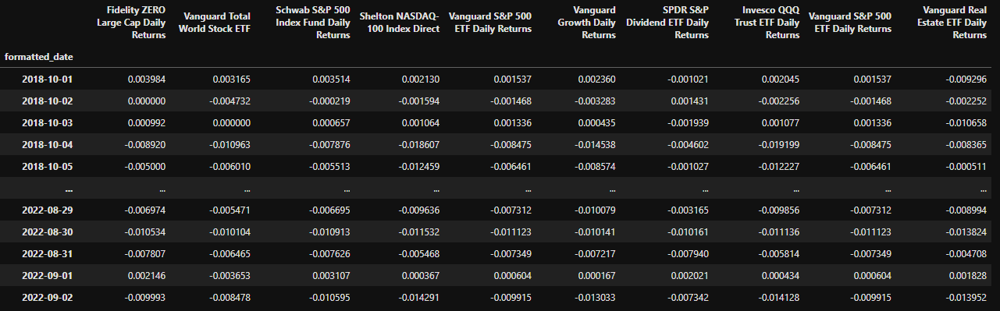

# Mutual Fund Portfolio 2022

## Background

Using quantitative analysis techniques with Python and Pandas, determine which portfolio is performing the best across multiple areas: volatility, returns, risk, and Sharpe ratios.

Create a tool (an analysis notebook) that analyzes and visualizes the major metrics of the portfolios across all of these areas, and determine which portfolio outperformed the others. 

1. [Read in and Wrangle Returns Data](#Prepare-the-Data)

2. [Determine Success of Each Portfolio](#Conduct-Quantitative-Analysis)

3. [Choose and Evaluate a Custom Portfolio](#Create-a-Custom-Portfolio)

---

## Instructions

**File:** [Whale Analysis Starter Code](Mutual_Fund_Portfolio_Analysis.ipynb)

### Prepare the Data

First, read and clean several data feeds using an API for analysis. 

1. Use Pandas to read the following API into a DataFrame. Be sure to convert the dates to a `DateTimeIndex`.

2. Detect and remove null values.

3. If any columns have dollar signs or characters other than numeric values, remove those characters and convert the data types as needed.

4. Convert the closing prices to daily returns.

5. Join all Returns into a single DataFrame with columns for each portfolio's returns.

    

### Conduct Quantitative Analysis

Analyze the data to see if any of the portfolios are outperformers.

#### Performance Analysis

1. Calculate and plot daily returns of all portfolios.

2. Calculate and plot cumulative returns for all portfolios. Which are the top 5 performers?

#### Risk Analysis

1. Create a box plot for each of the returns. 

2. Calculate the standard deviation for each portfolio. 

3. Determine which portfolios are riskiest.

4. Calculate the Annualized Standard Deviation.

#### Rolling Statistics

1. Calculate and plot the rolling standard deviation for all portfolios using a 21-day window.

2. Calculate and plot the correlation between each ETF.

3. Choose one portfolio, then calculate and plot the 60-day rolling beta.

#### Rolling Statistics Challenge: Exponentially Weighted Average

An alternative method to calculate a rolling window is to take the exponentially weighted moving average. This is like a moving window average, but it assigns greater importance to more recent observations. Try calculating the [`ewm`](https://pandas.pydata.org/pandas-docs/stable/reference/api/pandas.DataFrame.ewm.html) with a 21-day half-life.

### Sharpe Ratios

Investment managers and their institutional investors look at the return-to-risk ratio, not just the returns. After all, if you have two portfolios that each offer a 10% return, yet one is lower risk, you would invest in the lower-risk portfolio, right?

1. Using the daily returns, calculate and visualize the Sharpe ratios using a bar plot.

2. Determine the performance of the mutual funds.

---

## Resources

* [Pandas API Docs](https://pandas.pydata.org/pandas-docs/stable/reference/index.html)

* [Exponential weighted function in Pandas](https://pandas.pydata.org/pandas-docs/stable/reference/api/pandas.DataFrame.ewm.html)

---

## Hints

* After reading each API, don't forget to sort each DataFrame in ascending order by the Date using `sort_index`. This is especially important when working with time series data, as we want to make sure Date indexes go from earliest to latest.

* Be sure to use `head()` or `tail()` when you want to look at your data, but don't want to print to a large DataFrame.